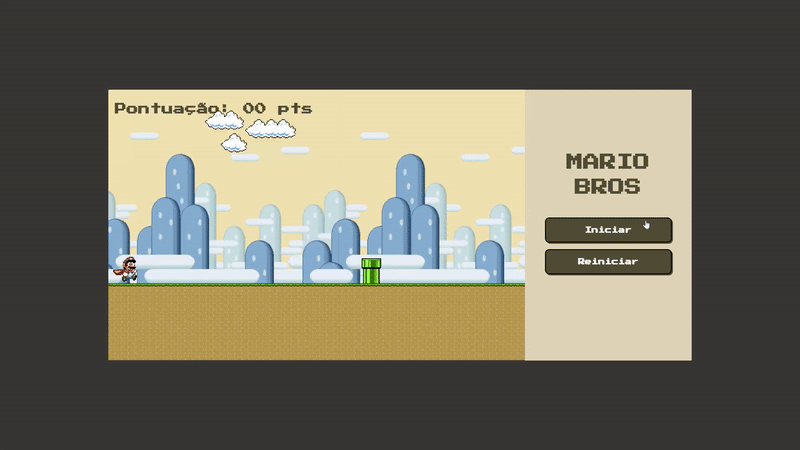

## :joystick: Web Game

  

## :file_folder: Sobre o projeto

  Esse projeto tem como o intuito introduzir o desenvolvimento web para alunos do projeto de extensão do IFCE Campus Maracanaú. O Web_Game busca simular o estilo de jogo   runner em que o personagem deve pular o obstáculo e vai ganhando pontuação com o decorrer do tempo do jogo. 

  O Web_Game foi pensando de forma que os alunos do projeto de extensão pudessem criar o seu próprio jogo utilizando sprites variados que foram disponibilizados, podendo   fazer um cenário completo do Mario, Sonic ou até mesmo a mistura de ambos mantendo a mecanica inicial do jogo.

## :desktop_computer: Tecnologias
As tecnologias utilizadas foram
- <a href="https://developer.mozilla.org/en-US/docs/Web/HTML">HTML</a>
- <a href="https://developer.mozilla.org/en-US/docs/Web/CSS">CSS</a>
- <a href="https://developer.mozilla.org/en-US/docs/Web/JavaScript">JavaScript</a>

## Licença
Projeto proposto e feito por <a href="https://www.linkedin.com/in/joao-pedro-silva-lopes/">João Pedro</a> e equipe do NDS (Núcleo de Desenvolvimento de Software)
